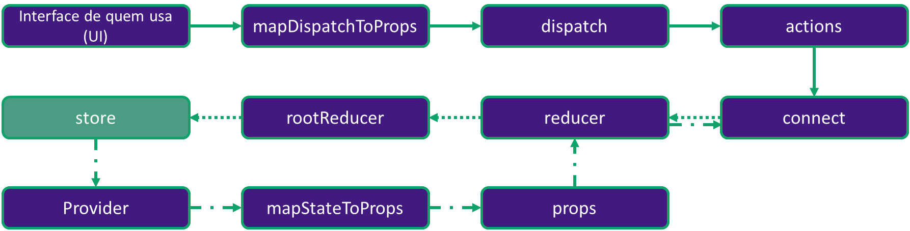
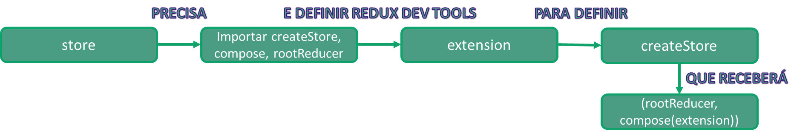

## Entendendo o infograma de uma store



### Análise do passo a passo


```javascript
cd missing_store
npm install
npm start
```

Abra a aplicação no browser para ver como ela está! Em src/store foi retirado o conteúdo no arquivo index.js.
Seu objetivo é criar o código da store para fazer a aplicação rodar corretamente com React-Redux.

Para facilitar a visualização dos estados, você pode acrescentar como segundo parâmetro do createStore a extensão Redux Devtools:

```javascript
const extension = window.devToolsExtension() || ((f) => f);
```

**Referências:**
- Imagem garfieldLasagna: https://pixy.org/src/124/1246733.jpg.
