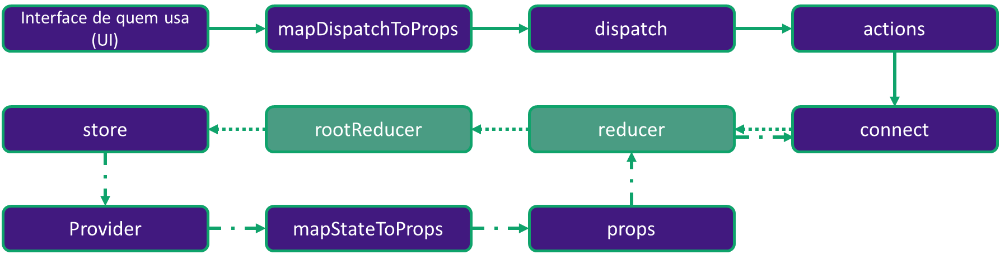
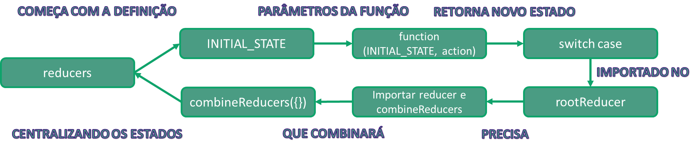

## Entendendo o infograma do reducer e rootReducer



### Análise do passo a passo


```javascript
cd missing_reducers
npm install
npm start
```

Em src/reducers:
- Foi retirada a função rootReducer do arquivo index.js;
- Foi retirada a função africaContinent do reducer Africa.js;
- Foi retirada a função americaContinent do reducer America.js;
- Foi retirada a função antarcticaContinent do reducer Antarctica.js;
- Foi retirada a função asiaContinent do reducer Asia.js;
- Foi retirada a função europeContinent do reducer Europe.js;
- Foi retirada a função oceaniaContinent do reducer Oceania.js;

**Seu objetivo é criar o código com o combineReducers no arquivo index.js, e criar as funções dos reducers que são responsáveis por receberem as actions que modificam os estados da aplicação.**

*Observação: Atenção aos estados iniciais dos reducers.*

**Referências:**

- Imagem wallpaper: https://snappygoat.com/o/ee85e2c2e41b4c3da574712e37920b745a7cd5dd/Dragon_Ball_Z_Analise_Imagem_Saga_Freeza.jpg;
- Gif genkidama: http://worldotaku.weebly.com/uploads/1/0/9/5/109555207/zhfbscufgp721_orig.gif;
- Imagem gokuxfreeza: http://www.comboinfinito.com.br/principal/wp-content/uploads/2017/12/Dragon-Ball-Super-Goku-vs-Freeza.jpg.