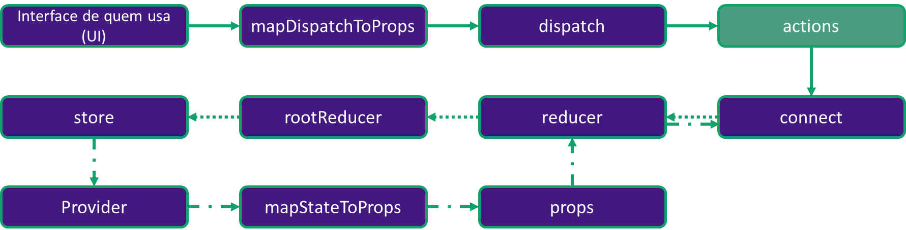

## Entendendo o infograma de uma action



### Análise do passo a passo


```javascript
cd missing_actions
npm install
npm start
```

Em src/actions foi retirada a action understandMatrix do arquivo index.js, que deverá receber um type 'PILL_TAKEN' e um 'id' como parâmetro.

**Seu objetivo é criar a action que retornará o objeto com o type e id que serão passados para o reducer.**

**Referências:**

- Imagem wallpaper: https://cdn.pixabay.com/photo/2020/07/02/04/31/matrix-5361690_1280.png;
- Gif neo: https://i2.wp.com/emceenetwork.com/wp-content/uploads/2018/05/Matrix-gif.gif?fit=500%2C208&ssl=1&w=640;
- Gif john-wick: https://data.whicdn.com/images/325144945/original.gif;
- Imagem blue-pill: https://projectinsides.com/wp-content/uploads/2017/08/Blue-pill.png;
- Imagem red-pill: https://projectinsides.com/wp-content/uploads/2017/08/Red-pill.png.
