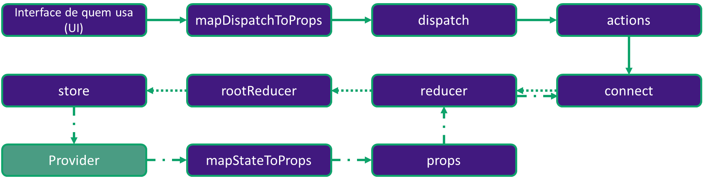

## Entendendo o infograma de um Provider



### Análise do passo a passo


```javascript
cd missing_provider
npm install
npm start
```

Em src/index.js foram retiradas todas as configurações de um Provider. Primeiramente é preciso importá-lo do 'react-redux' e então utilizá-lo para encapsular o App. Não se esqueça de passar a store como props para todos os componentes filhos do Provider.

**Seu objetivo é configurar o Provider corretamente para que todos os componentes da aplicação recebam os estados contidos na store.**

**Referências:**

- Imagem wallpaper: https://upload.wikimedia.org/wikipedia/commons/9/92/M45_The_Pleiades_Seven_Sisters.jpg;
- Imagem geminisaga: https://upload.wikimedia.org/wikipedia/it/b/b5/GeminiSaga.png;
- Imagem seiyafivesenses: https://image.myanimelist.net/ui/5LYzTBVoS196gvYvw3zjwHoTb4e0Tq3stF8c5dMOzSA.
