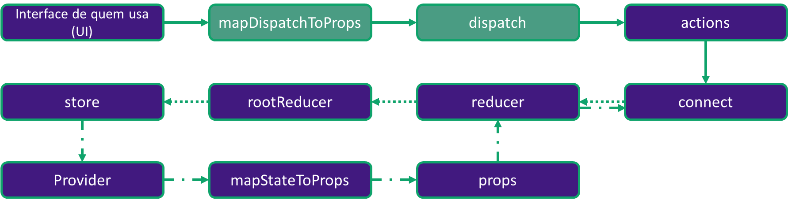
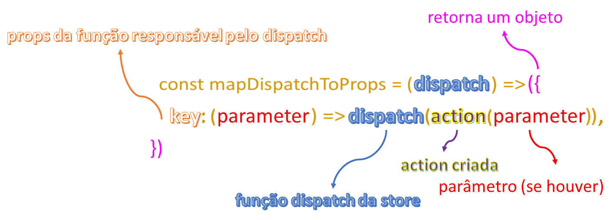

## Entendendo o infograma do mapDispatchToProps e dispatch



### Análise do passo a passo




```javascript
cd missing_mapdispatchtoprops
npm install
npm start
```

Em src/pages foi retirado o mapDispatchToProps e o dispatch da página Form.js. Você deve criar a função que retorna um objeto de chave selectedOmega. A chave selectedOmega é a função que é recebida como props dentro da aplicação. Após declarar a chave, é necessário disparar a ação showMutant através do dispatch. Não se esqueça que a função selectedOmega recebe um parâmetro e que esse parâmetro deverá ser passado para a action showMutant.

**Seu objetivo é configurar o mapDispatchToProps e o dispatch para disparar a ação responsável pela alteração do estado da aplicação.**

**Referências:**

- Imagem wallpaper: https://pixy.org/src/62/629825.jpg;
- Imagem jeangrey: https://www.fatosdesconhecidos.com.br/wp-content/uploads/2019/07/Uncanny-X-Men-Jean-Grey-Featured-1024x512.jpg;
- Imagem legiao: https://www.fatosdesconhecidos.com.br/wp-content/uploads/2019/07/david-haller-from-the-comics-exists-in-the-insane-multiverse-of-legion-1024x768.jpeg;
- Imagem magneto: https://www.fatosdesconhecidos.com.br/wp-content/uploads/2019/07/Brotherhood-Magneto.jpg;
- Imagem misterm: https://www.fatosdesconhecidos.com.br/wp-content/uploads/2019/07/mister-m.jpg;
- Imagem proteus: https://www.fatosdesconhecidos.com.br/wp-content/uploads/2019/07/Screenshot_2-11.jpg;
- Imagem quentinquire: https://www.fatosdesconhecidos.com.br/wp-content/uploads/2019/07/quentin-quire-header-1024x512.jpg;
- Imagem tempestade: https://www.fatosdesconhecidos.com.br/wp-content/uploads/2019/07/xmenstorm2.0-1024x683.jpg;
- Imagem vulcano: https://www.fatosdesconhecidos.com.br/wp-content/uploads/2019/07/Vulcan-Marvel.jpg;
- Imagem jamiebraddock: https://www.fatosdesconhecidos.com.br/wp-content/uploads/2019/07/Jamie-Braddock.jpg;
- Imagem hopesummers: https://www.fatosdesconhecidos.com.br/wp-content/uploads/2019/07/Hope-Summers.jpg;
- Imagem franklinrichards: https://www.fatosdesconhecidos.com.br/wp-content/uploads/2019/07/Screenshot_3-6-1024x609.jpg;
- Imagem homemdegelo: https://www.fatosdesconhecidos.com.br/wp-content/uploads/2019/07/Screenshot_1-19-1024x643.jpg;
- Imagem exodus: https://www.fatosdesconhecidos.com.br/wp-content/uploads/2019/07/exodus-x-men-legacy.jpg;
- Imagem elixir: https://www.fatosdesconhecidos.com.br/wp-content/uploads/2019/07/Uncanny-X-Men-Annual-1-feat-1-1024x536.jpg.
