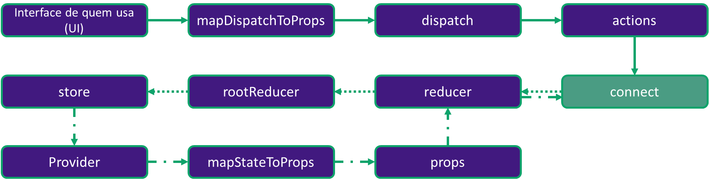
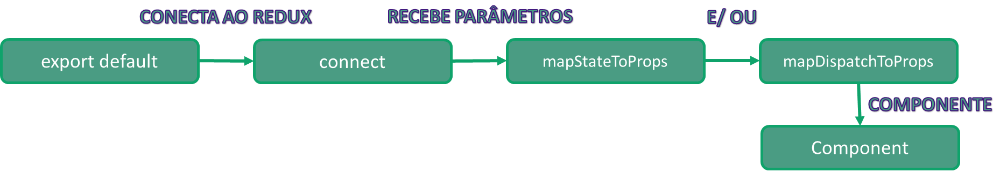

## Entendendo o infograma do connect



### Análise do passo a passo


```javascript
cd missing_connect
npm install
npm start
```

Em src/App.js e src/components/RescuePeach.js foram retirados o export defaut connect()(), portanto, os componentes não são localizados e não recebem nenhum dado do Redux. 

**Seu objetivo é configurar o connect de acordo com a necessidade de cada componente, fazendo a aplicação funcionar com React-Redux.**

**Referências:**

- Imagem mario: https://pixy.org/src/149/1494229.png;
- Imagem marioepeach: https://upload.wikimedia.org/wikipedia/it/1/12/Peach_Toadstool.png; https://pixy.org/download/1270955/;
- Imagem peach: https://upload.wikimedia.org/wikipedia/sco/d/d5/Peach_%28Super_Mario_3D_World%29.png;
- Imagem map: https://i.pinimg.com/originals/ee/64/0c/ee640c8170c171bd1c38ae1fc8f24736.png;
- Imagem supermarioworld: https://static.wikia.nocookie.net/pai_troll/images/1/14/Super_Mario_World.png/revision/latest?cb=20200608204935&path-prefix=pt-br;
- Gif thankyou: https://i.pinimg.com/originals/e2/dd/c8/e2ddc86e61bf14f62043f4509a25d19b.gif.
